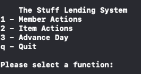
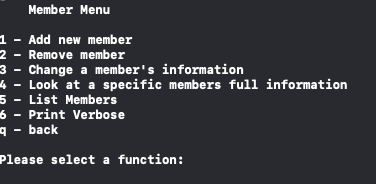
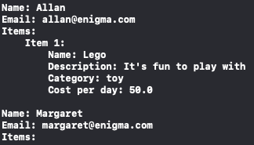
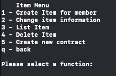
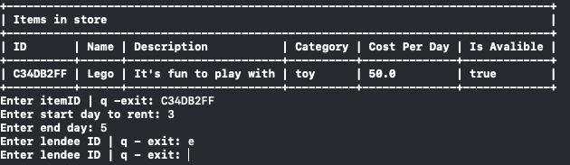
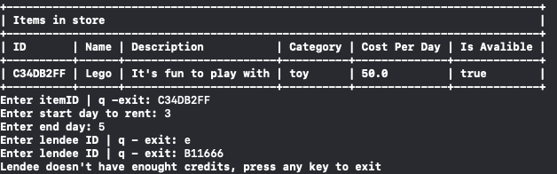
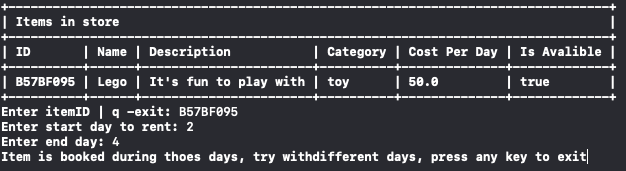
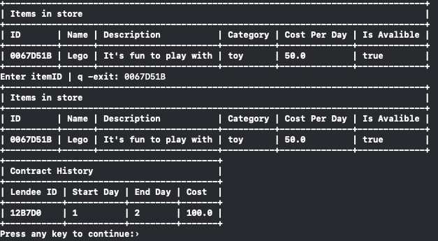

# Setup

To be able to run this, you are going to have docker installed.
To install docker, pls refer to the official website:

Go here to <a href=https://docs.docker.com/get-docker/>Download Docker</a>

## How to check out the project

### Building

To build the project run:

```docker
docker build . --file development.Dockerfile --tag `build-name`
```

### Running

```docker
docker run -it --rm `build-name`
```

# Using the application

Note: Everytime you select a function in the menu you also have to press return(Enter)

1. When you run the aplication you will get the main menu and have to select what functions you want to continue: <br>
   &nbsp;&nbsp;&nbsp;&nbsp; 

   1.1. If you select Member Function you will be redirected to this menu:
   &nbsp;&nbsp;&nbsp;&nbsp;&nbsp;&nbsp;&nbsp;&nbsp; <br>
   1.2. For this tutorial we will look at the Print Verbose option since the other are pretty clear
   &nbsp;&nbsp;&nbsp;&nbsp;&nbsp;&nbsp;&nbsp;&nbsp; 
   &nbsp;&nbsp;&nbsp;&nbsp;&nbsp;&nbsp;&nbsp;&nbsp; This will print the name, email of the members and if they have any items it will print them also, if the item has an active contract it will print he lendee name and the period it was lended for.
   <br>
   1.3. After the verbose function is finished it will return us to the Member Menu and if we press q + Return it will go back to the Main Menu
   <br>

   1.4. If you select Item Actions you will be redirected to this menu:
   &nbsp;&nbsp;&nbsp;&nbsp;&nbsp;&nbsp;&nbsp;&nbsp; 
   &nbsp;&nbsp;&nbsp;&nbsp;&nbsp;&nbsp;&nbsp;&nbsp; In this menu most of the functions will require you to input the either the memberID or the itemID (e.g If you want to create an item for a member you will have to input the meberID).
   the function to delete an item will print an error if the item is currently booked.
   <br>

   1.5. Here I will demonstrate adding a contract:
   &nbsp;&nbsp;&nbsp;&nbsp;&nbsp;&nbsp;&nbsp;&nbsp; 
   &nbsp;&nbsp;&nbsp;&nbsp;&nbsp;&nbsp;&nbsp;&nbsp; Here we can see that the imputed memberID is incorrect so it asks us for an ID again or we can quit the function.
   &nbsp;&nbsp;&nbsp;&nbsp;&nbsp;&nbsp;&nbsp;&nbsp; 
   &nbsp;&nbsp;&nbsp;&nbsp;&nbsp;&nbsp;&nbsp;&nbsp;Here we imputed a valid ID but the member doesn't have enought credits so we have to press a key + Return to return to exit. It will do the same thing if the item is booked during the inputted dates:
   &nbsp;&nbsp;&nbsp;&nbsp;&nbsp;&nbsp;&nbsp;&nbsp; 
   &nbsp;&nbsp;&nbsp;&nbsp;&nbsp;&nbsp;&nbsp;&nbsp; It will also check if the start day is before the end day and also if the inputted days are integers and not numbers.
   &nbsp;&nbsp;&nbsp;&nbsp;&nbsp;&nbsp;&nbsp;&nbsp; If we want to see full details about an item we go to choice "3 - List Item" there it will print all of the items and at the end it will ask us the itemID if the item we want to see full information:
   &nbsp;&nbsp;&nbsp;&nbsp;&nbsp;&nbsp;&nbsp;&nbsp; 
   <br>
   1.6. In the main menu we have a third option called "Advance day" this allows us to simulate the time to see if the system works. When we advance a day the system will check the items and will turn the isAvalible field to false if the item is booked during that day.

The system implements everything necessary for grade 2, in my intense testing I tried to value check so that the program won't crash, if the wrong data is inputed it will either return to the previous menu or will ask thhe user for another inout or to quit this function.
In some cases for example if you create an item or a new member and you don't input anything and press enter it will still continue with the empty string. Besides that the program doesn't crash and implements every function from the Functional Requirements
