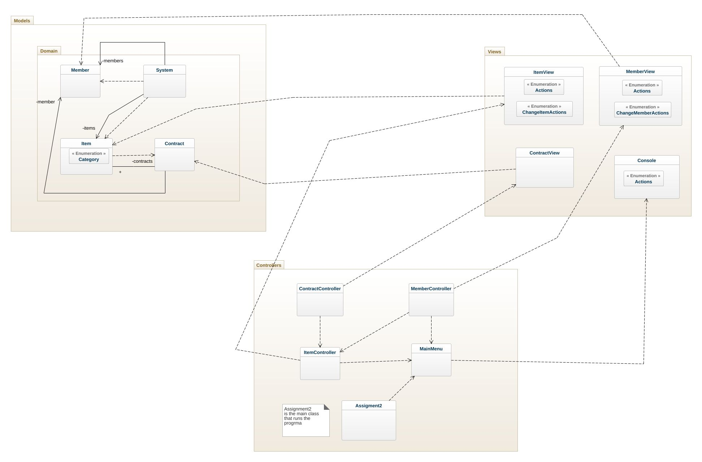
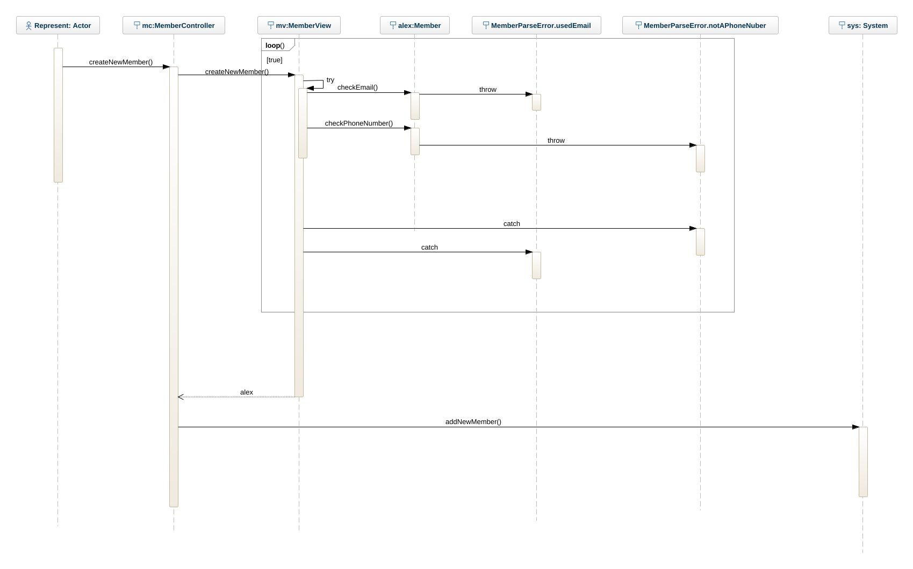
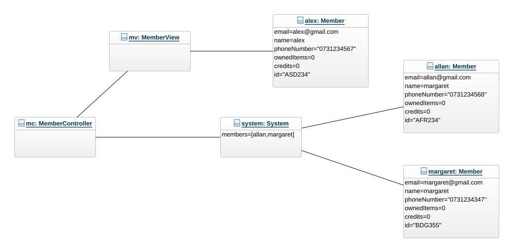

# Class diagram

In mi controllers i do not have a variable to initialize the views because since in swift it is not required to initilize them separately to access a function, I thought it woudn't make sense to store that variable somewhere when we don't know if we are even going to use it. This way if we wanna call a function to print somethig we just call the struct + the function and then we discard that initialization because the views don't modify anything and do not store any data it just prints information. The only model that is initialized if the system because it keeps track of the days, members, items and contracts.

# Sequence diagram

Here is a representation of the login sequence, first the user has to input all of the data required, then it checks if the data is accepted and checks if the email or the phone number are already in the system if true it throws and error and it ask the user for a different email or phone number, after everything is done the loop ends and the view return a member and the controller calls for the system function to add a member and passes the new member variable.

# Object diagram

